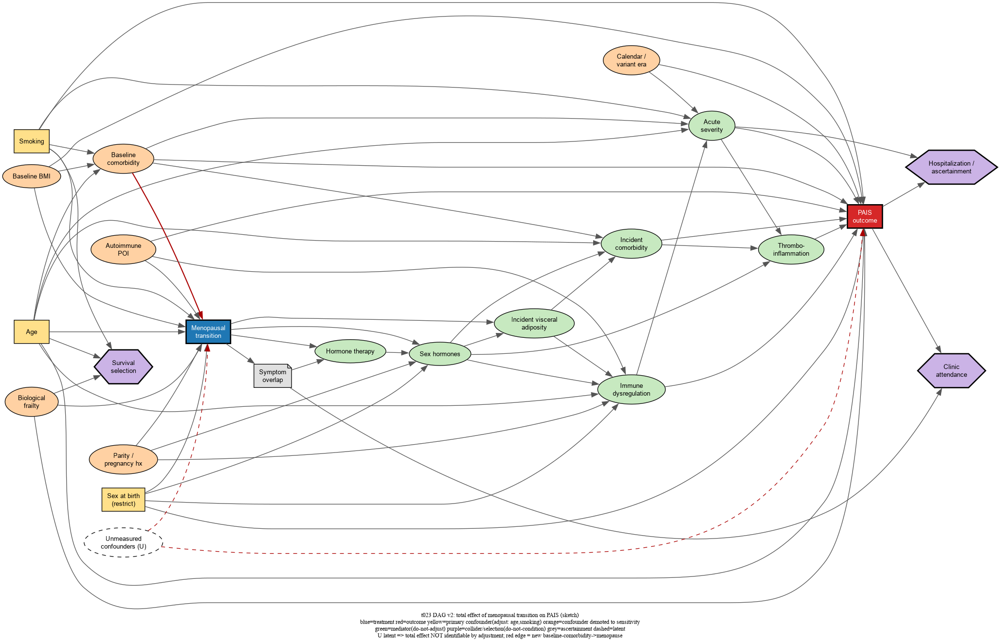

# Causal DAG: menopausal transition and PAIS risk (t014 / t023 v2)

Sketch-stage causal inquiry built for **task t014** and redrawn under **task t023
(v2)**, operationalizing `hypothesis:0005-reproductive-stage-immune-homeostatic-margin`
and `question:0013`. The machine-readable model lives in the inquiry patch
`entities/patches/menopause-pais-causal-dag.md` (**v2: 23 variables, 59 `scic:causes`
edges**) and materializes into the `inquiry/menopause-pais-causal-dag` named graph.

## Locked primary estimand

**Total effect** of **menopausal transition (reproductive stage)** on the
**PAIS outcome** (failed post-infectious recovery), in a **natal-female**
target population.

- **Adjust — primary measured adjustment set: `{age, smoking}`.** (Sex assigned at
  birth is handled by population restriction to natal females.) **Not** called
  "minimal-sufficient": per the DAG critique, **no valid sufficient adjustment set
  exists while U is latent**, so `{age, smoking}` is the *primary measured* set, not
  an identifying one. Smoking was promoted to the primary set by the t029 reviewer
  (Q1); see `doc/methods/2026-06-19-confounder-open-questions-and-staged-amendment.md`.
  > **v2 identification finding (t023, 2026-06-21).** Once the v2 structural edges
  > are drawn (`baseline-comorbidity → menopause`, plus `smoking / baseline-BMI /
  > parity / autoimmune-POI / frailty → menopause`), each of those nodes becomes a
  > **formal confounder**. With U set aside, the unique minimal sufficient *measured*
  > set is the **full battery** `{age, smoking, baseline-comorbidity, baseline-BMI,
  > parity, autoimmune-POI, frailty}` — `{age, smoking}` alone is **not** sufficient
  > in v2. The committed primary `{age, smoking}` is therefore a deliberate
  > measured-**subset**; the other five are confounders-by-structure **demoted to
  > sensitivity arms** by judgement (t029 Q2/Q3). This documents structure and
  > sensitivity scope only; it does **not** change `pre-registration:0001` and
  > triggers **no** amendment.
- **Do NOT adjust (mediators):** sex hormone levels, immune dysregulation,
  thromboinflammation/endothelial dysfunction, acute infection severity, incident
  cardiometabolic comorbidity, incident visceral adiposity.
- **Never condition (colliders):** clinic attendance, hospitalization/ascertainment,
  survival selection.
- **Identifiability:** **not identifiable by adjustment alone** while unmeasured
  shared confounders (U) are latent — requires measured proxies for U and/or
  E-value bounding (see critique). The v2 redraw does not rescue this.

This encodes h0005's conjecture that menopause is not a direct cause of PAIS but
a threshold-shifter acting *through* hormone-driven immune, endothelial, and
autonomic pathways. A **severity-controlled direct effect** (additionally
conditioning on acute severity) is the planned secondary estimand.

## Diagram

DOT source: [`assets/menopause-pais-causal-dag.dot`](assets/menopause-pais-causal-dag.dot)
(regenerate the PNG with `dot -Tpng`).

Legend (v2): blue = treatment, red = outcome, yellow = **primary** confounder
(adjust: age, smoking), orange = confounder **demoted to sensitivity**
(baseline-comorbidity, baseline-BMI, parity, autoimmune-POI, frailty, era),
green = mediator (do-not-adjust; includes the incident comorbidity/adiposity
time-split partners), grey note = ascertainment, purple hexagon = collider/
selection (do-not-condition: clinic, hospitalization, survival selection),
dashed = latent/unmeasured. The bold red `baseline-comorbidity → menopause` edge
is the new confounder edge the split made acyclic.

## Node roles (v2, pre-declared per t014/t023)

| Node | Role w.r.t. menopause → PAIS | Handling |
|---|---|---|
| Chronological age | Confounder (dominant) | **Adjust (primary)** |
| Smoking | Confounder (measured, strong) | **Adjust (primary)** — t029 Q1 |
| Sex assigned at birth | Population-definition given | Restrict to natal females |
| Baseline cardiometabolic comorbidity | Confounder (gains `→ menopause` edge) | Sensitivity arm |
| Baseline BMI / adiposity | Confounder | Sensitivity arm |
| Parity / pregnancy history | Staging input + candidate confounder | Sensitivity arm; guard estimand drift |
| Autoimmune POI | Confounder (etiologic stratum) | Stratum/quarantine + sensitivity |
| Biological frailty | Confounder + selection/competing-risk | Selection model + sensitivity |
| Calendar / variant / vaccination era | Confounder of mediator→outcome path | Adjust only for direct-effect secondary |
| Sex hormone levels | Mediator (first line) | Do not adjust (total effect) |
| Hormone therapy | Mediator + confounding-by-indication | Separate target-trial estimand (t019) |
| Incident cardiometabolic comorbidity | Mediator | Do not adjust |
| Incident visceral adiposity | Mediator (M1 path) | Do not adjust |
| Immune dysregulation | Mediator | Do not adjust |
| Thromboinflammation / endothelial dysfunction | Mediator | Do not adjust |
| Acute infection severity | Mediator | Do not adjust (condition only for direct effect) |
| Menopause-PAIS symptom overlap | Ascertainment / measurement | Model misclassification |
| Clinic attendance | **Collider** | **Do not condition** |
| Hospitalization / ascertainment | **Collider** (selection) | **Do not condition** |
| Survival selection / left-truncation | **Collider** (selection) | **Do not condition** |
| Unmeasured shared confounders (U) | Latent confounder | Identifiability threat (non-identifiable as drawn) |

## Validation (v2)

`science inquiry validate menopause-pais-causal-dag`:

- `boundary_reachability` **pass**, `no_cycles` **pass**, `causal_acyclicity` **pass**, `target_exists` **pass**.
- `orphaned_interior` **warn** (expected): the sink colliders (`clinic_attendance`,
  `hospital_ascertainment`, `survival_selection`) and the exogenous latent root
  (`unmeasured_shared_confounders`). All expected by design.
- **pgmpy/networkx back-door re-derivation (2026-06-21, direct on the authored edge
  list — `export-pgmpy` still emits empty, see critique tooling note):** 23 nodes /
  59 edges, **acyclic**. **U latent → no valid measured adjustment set
  (non-identifiable)**; U set aside → unique minimal measured set is the **full
  battery** `{age, smoking, baseline-comorbidity, baseline-BMI, parity,
  autoimmune-POI, frailty}` (`{age, smoking}` alone insufficient). Colliders appear
  in **no** recommended set.

## Key open issue (unchanged by v2)

The **unmeasured shared confounders (U)** node (SES, prior EBV/autoimmunity,
genetic/HLA risk, health behaviours) is a common cause of treatment and outcome,
so the total effect is **not identifiable by back-door adjustment on observed
variables alone** — v2's added confounders do not touch the U path. The resolution
routes remain: (a) argue U is negligible/blocked by proxies + E-value bounding,
(b) the MR triangulation arm (t029 Q4, exogenous to SES/smoking/survival), or
(c) accept partial identification and bound it. v2's contribution is to make the
**measured** confounder structure honest (the seven-node battery) and to separate it
cleanly from the latent-U threat.

## Next steps

1. (optional) re-run `/science:critique-approach menopause-pais-causal-dag` on v2 —
   the structural fixes it staged are now applied; a second pass would stress-test
   the new selection colliders and the era node.
2. `/science:plan-analysis` (t016) — already encodes the `{age, smoking}` primary set
   against the measured cohort; v2 adds the demoted-confounder battery as the
   sensitivity-arm scope, and the MR arm as triangulation.
